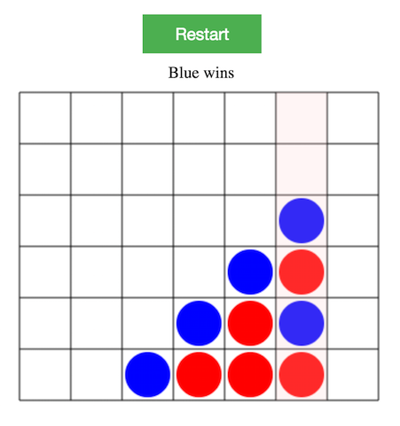

# The Connect 4 Game

Built with typescript and webpack.



## Installation

### 1. Prerequisite: `yarn`

[Install yarn](https://yarnpkg.com/en/docs/install#mac-tab) if you haven't.

### 2. Setup

In your terminal, run commands:

```
git clone https://github.com/zzhjerry/connectFour.git
cd connectFour
yarn install
yarn run serve
```

### 3. Start playing

open [http://localhost:8080/](http://localhost:8080/)

**Have fun!**

## Development notes

**1. workflow**

All development source files are inside `app` folder. If you run `yarn
run build`, the typescript files will be compiled, bundled and copied
into `dist/application.js`. The command will also copy
`app/index.html` into `dist/index.html`. Note `dist` folder is a new
generated folder in the project root directory. So now if you open
`dist/index.html`, you should be able to play the game. The
`dist/index.html` file and `dist/application.js` file are the only two
files you need in production.

If you run `yarn run serve`, you are actually running
`webpack-dev-server`. Then when you make any changes to `index.html`
or the typescript files and save
them, [http://localhost:8080](http://localhost:8080) will be reloaded
to reflect the change. Keep one terminal session running this command
during development will kill lots of overheads (run command to compile
typescript, refresh browser etc.).

**2. directory structure**

```
app
├── index.html
└── typescript
    ├── connect4.ts
    ├── elements.ts
    ├── game.ts
    └── main.ts
```

- `main.ts` is the entry point of the game. It initiates a `Game`
  instance and starts it. This file is also the one that `webpack`
  will check to resolve source file dependencies for compilation
  purpose.
- `game.ts` handles the graphical rendering logic for the game. All
  drawing works are done by using `<canvas>` API.
- `connect4.ts` implements the core win & lose logic for the game. It
    uses bitboard to record moves and detect whether the balls are
    lined properly.  The idea is borrowed from
    https://github.com/qu1j0t3/fhourstones/blob/master/Game.java
- `elements.ts` abstracted `Ball` and `Player`, which are the most
  ofen referred objects in lower level codes.
